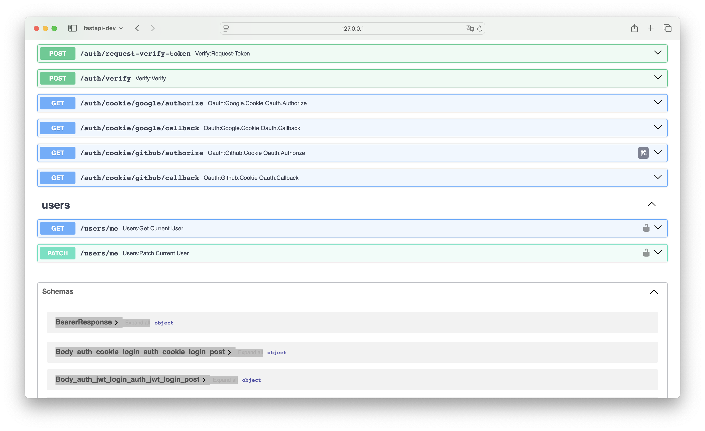

# 🚀 FastAPI Auth Starter Kit — Google & GitHub OAuth + React

This is a starter project for building an AI web service with FastAPI and React.

If you're using the [fastapi-users](https://github.com/fastapi-users/fastapi-users) library for authentication, you'll find there's a lot to set up: configuring APIs, setting up Google and GitHub OAuth, adding tests with pytest, setting up a code linter, and more. It can take a lot of time.

And if you rely too much on LLM-generated code, the result is often insecure and messy.

So I created this project to save you time and give you a clean starting point.

- Backend (FastAPI): [service-base-auth-fastapi](https://github.com/PeterTakahashi/service-base-auth-fastapi)
- Frontend (React + Vite): [service-base-auth-react-vite](https://github.com/PeterTakahashi/service-base-auth-react-vite)

## Key Dependencies

This project uses several well-known Python libraries to build a scalable and secure authentication service:

- **FastAPI** (>=0.115.12): A modern, high-performance web framework for building APIs with Python 3.7+ based on standard Python type hints.
- **SQLAlchemy** (>=2.0.40): The SQL toolkit and ORM used for database access and schema management.
- Alembic (>=1.15.2): A lightweight database migration tool for use with SQLAlchemy.
- **FastAPI Users** (>=14.0.1): Extensible user management for FastAPI, including authentication and OAuth support.
- **Uvicorn (>=0.34.2)**: A lightning-fast ASGI server used to run FastAPI in production.
- **Pydantic (>=2.11.3)**: Used for data validation and settings management with type annotations.
- **Pytest (==7.2.2)**: A mature testing framework used with additional plugins for testing asynchronous code.

## Installation

### Local setup

#### Docker

```bash
docker exec -it service-base-web bash
source .venv/bin/activate

pytest --cov=app --cov-report=term-missing --cov-report=html
open htmlcov/index.html # if you wanna see cov report

open http://localhost:1080 # open mail log
open http://127.0.0.1:8000/app/v1/docs # open api docs

```

#### create db migration file

```bash
alembic revision --autogenerate -m ""
```

#### db migrate

```bash
alembic upgrade head
```

#### reset table

```bash
docker compose down -v
```

#### create schema

```bash
python -m scripts.create_schema
```

#### code formatter

```
black .
ruff check . --fix
```

#### code checker

```
ruff check .
mypy --config-file mypy.ini .
```

#### OpenAPI

html
http://0.0.0.0:8000/app/v1/docs#/

json
http://0.0.0.0:8000/app/v1/openapi.json

##### API docs





